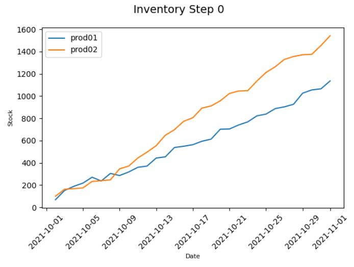

# Procurement Reinforcement Learning Environment
A prototype environment based on [Gym](https://gym.openai.com/).
It describes the simplified procurement process and includes Orders based on custom Products.
## Status

Inital stage - work in progress - PR/Forks welcome!

## Run
Clone/Download Repository and execute `example.py`

## Requirements
- Python 3.6+
- Gym 0.18.0
- Matplotlib 3.4+

## Example Plot
Example: Stock with random agent over one episode:

## Further Ideas
Functionality
- Extended Reward Function
- Different Order/Deliver Date
- Add different bulk order prices to Products
- volatile market pricing  
- Different Manufacturer
- Customer/Supplier Policies
- Different Pricing per Product/Customer/Supplier
- Expiration day for stock
- additional agents (Q-Learning, Greedy etc...)
Technology
- add Numpy/Pandas to improve performance
- publish on pip
  

## License
**[MIT license](http://opensource.org/licenses/mit-license.php)**

Copyright 2021 © Lukas Engelfried, Stefan Sarawsinky, Malte Grosse.